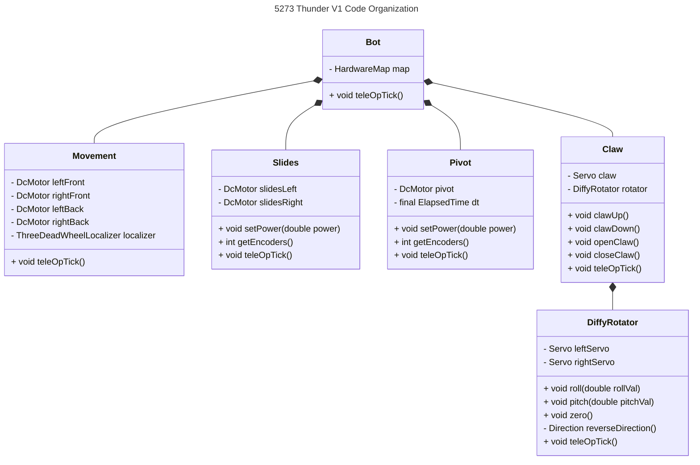

```mermaid
---
title: 5273 Thunder V1 Code Organization
---
classDiagram
class Bot{
    - HardwareMap map
    + void teleOpTick()
}
class Movement{
    - DcMotor leftFront
    - DcMotor rightFront
    - DcMotor leftBack
    - DcMotor rightBack
    - ThreeDeadWheelLocalizer localizer
    + void teleOpTick()
}
class Slides{
    - DcMotor slidesLeft
    - DcMotor slidesRight
    + void setPower(double power)
    + int getEncoders()
    + void teleOpTick()
}
class Pivot{
    - DcMotor pivot
    - final ElapsedTime dt
    + void setPower(double power)
    + int getEncoders()
    + void teleOpTick()
}
class DiffyRotator{
    - Servo leftServo
    - Servo rightServo
    + void roll(double rollVal)
    + void pitch(double pitchVal)
    + void zero()
    - Direction reverseDirection()
    + void teleOpTick()
}
class Claw{
    - Servo claw
    - DiffyRotator rotator
    + void clawUp()
    + void clawDown()
    + void openClaw()
    + void closeClaw()
    + void teleOpTick()
}

Bot *-- Claw
Claw *-- DiffyRotator
Bot *-- Pivot
Bot *-- Movement
Bot *--Slides
```